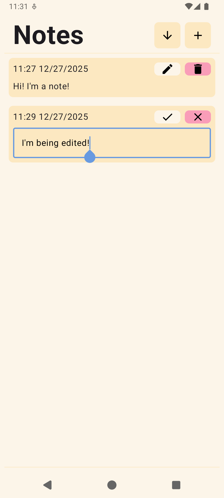
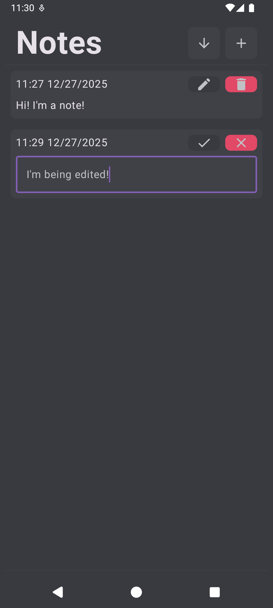

# Android Notes App
by arkellmer

&nbsp;

This project aims to create a simple to use, functional notes application for android.
This goal will be achieved using the following techniques:
- MVVM app and folder structure to maintain separation of concerns
- Utilizing a room database for permanent note storage
- Testing all functionality for easy and quick bugfixes

&nbsp;

### Light Mode

### Dark Mode

